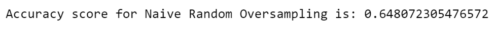
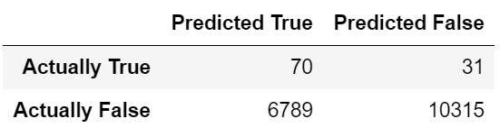
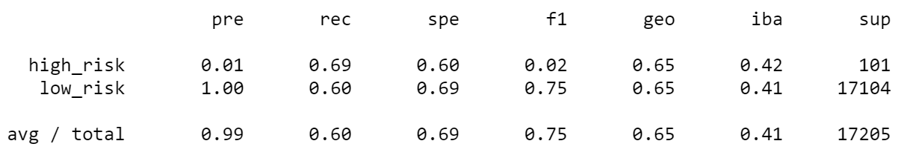
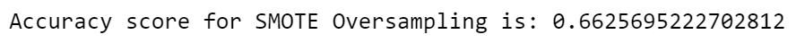
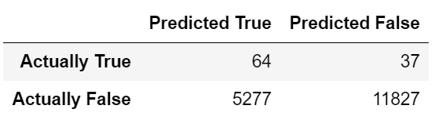
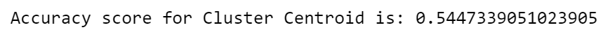
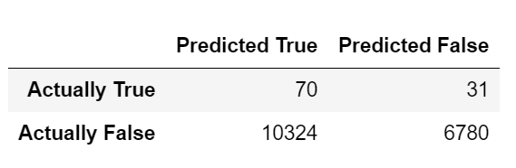
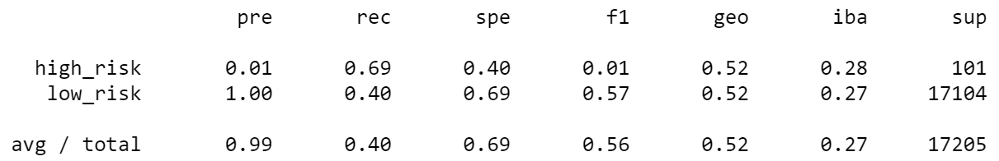

# Credit_Risk_Analysis
Imbalanced-learn library, supervised learning, Scikit-learn machine learning library for Python (sklearn), supervised learning in linear models (linear regression; logistic regression), Accuracy/Precision/sensitivity(recall)/F1 score, confusion matrix, SVM(Support Vector Machine – support vector, hyperplane), data preprocessing: - labelling (encoding),  - Data Scale: Normalization (Standard scaler – mean = 0, variance = 1), Decision Trees, Ensemble Learning – Random Forest (weak/moderate/strong learner), Bootstrap Aggregation, Boosting: Adaptive boosting (AdaBoost), Gradient Boosting, for Class imbalance (solution 1: Oversampling (Random oversampling, synthetic minority oversampling technique (SMOTE)), solution 2: Undersampling (Random undersampling, Cluster Centroid undersampling, solution 3: SMOTEENN)

## Overview of the Project
Credit risk is an inherently unbalanced classificaiton problem. The project uses multiple supervised learning techniques (imbalanced-learn, scikit-learn library) to train and evaluate models with unbalanced classes. Raw data gets splitted into training and testing data for model performance assessment. The analysis applies Naive Random Oversampling, SMOTE Oversampling, Cluster Centroid undersampling, SMOTEENN resampling, Random Forest Classifier and Adapt Boost Classifier to predict the credit risk. In the end the analysis evaluate the performance of each model and provide recommendation for credit risk assessment.

## Result
- Naive Random Oversampling
Accuracy Score:  
  
Confusion Matrix:  
  
Classification Report:
  
- SMOTE
Accuracy Score:  
  
Confusion Matrix:  
  
Classification Report:  
![smote_classification_report.PNG]](image/smote_classification_report.PNG)  
- Cluster Centroids Undersampling  
Accuracy Score:  
  
Confusion Matrix:  
  
Classification Report:  
  
- 
